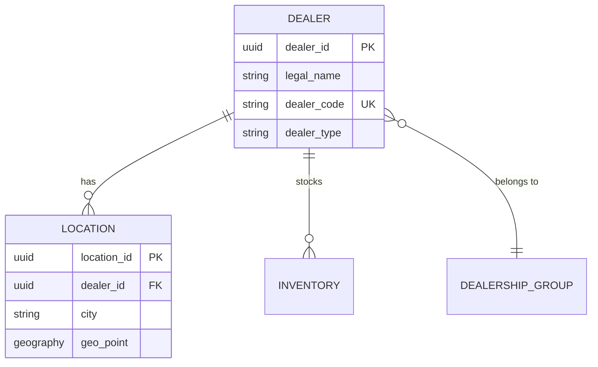
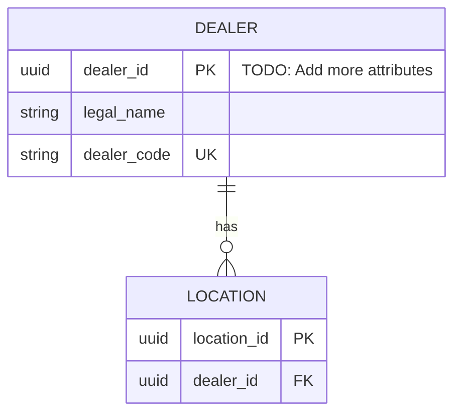

# Exercise 1: Entity Modeling
## Design the Dealer Entity Registry

**Duration**: 3 hours
**Squad**: Squad A (Data Architects)
**Day**: Day 2 Morning

---

## 🎯 Objective

Design the data model that will power AI search for 3,200 Ford/Lincoln dealers. You're creating the "source of truth" that feeds Schema.org templates, API responses, and ultimately, LLM knowledge.

**Success Criteria**:
- ✅ Complete Entity-Relationship diagram (Mermaid format)
- ✅ PostgreSQL database schema with indexes
- ✅ OpenAPI specification for REST API
- ✅ Clear documentation of design decisions

---

## 🧠 Context

From Exercise 0, you learned that LLMs need:
- Dealer names and addresses (NAP - Name, Address, Phone)
- Real-time inventory
- Service capabilities
- Hours of operation
- Reviews and ratings

**Your challenge**: Model this data in a way that:
1. **Scales** to 3,200 dealers
2. **Updates** frequently (inventory changes hourly)
3. **Integrates** with existing FordDirect systems
4. **Generates** Schema.org JSON-LD dynamically

---

## 📋 Requirements

### **Core Entities** (Minimum)

You must model AT LEAST these entities:

1. **Dealer**
   - Basic information (name, dealer code, type)
   - Contact information
   - Brand affiliations (Ford, Lincoln, both)

2. **Location**
   - Physical addresses (dealers can have multiple locations)
   - Geo-coordinates for proximity search
   - Hours of operation
   - Amenities

3. **Inventory**
   - Vehicles in stock (linked by VIN)
   - Pricing information
   - Availability status

4. **Vehicle Specification**
   - Reference data (make, model, trim, year)
   - Features and options
   - OEM specs (MPG, towing capacity, etc.)

5. **Review**
   - Customer reviews from multiple sources
   - Ratings and sentiment
   - Response from dealer

### **Advanced Entities** (Recommended)

6. **Service Capability**
   - Types of service offered (maintenance, collision, EV charging)
   - Certifications (Ford-certified technicians)
   - Service hours (may differ from sales hours)

7. **Dealership Group**
   - Corporate structure for multi-location dealers
   - Shared services and resources

8. **Special Offering**
   - Fleet sales capabilities
   - Commercial truck upfitting
   - EV infrastructure (charging stations)

---

## 🛠️ Deliverables

### **Deliverable 1: Entity-Relationship Diagram**

**File**: `solution/dealer-entity.mermaid`

**Requirements**:
- Use Mermaid syntax
- Show all entities and relationships
- Include cardinality (1:1, 1:N, N:M)
- Annotate key attributes
- Show primary and foreign keys

**Example Structure**:


**Test Your Diagram**:
- [Mermaid Live Editor](https://mermaid.live/)
- Paste your code, verify it renders

---

### **Deliverable 2: Database Schema**

**File**: `solution/database-schema.sql`

**Requirements**:
- PostgreSQL 16+ syntax
- Proper constraints (NOT NULL, CHECK, UNIQUE)
- Indexes for performance:
  - Full-text search on dealer names
  - Geospatial search on locations
  - Inventory lookups by VIN
- Foreign key relationships with CASCADE rules
- Timestamps for audit trail

**Key Considerations**:

1. **Geospatial Queries**:
   ```sql
   CREATE EXTENSION IF NOT EXISTS postgis;

   CREATE TABLE locations (
       ...
       geo_point GEOGRAPHY(POINT, 4326),
       ...
   );

   CREATE INDEX idx_locations_geo ON locations USING GIST(geo_point);
   ```

2. **Full-Text Search**:
   ```sql
   ALTER TABLE dealers
   ADD COLUMN search_vector tsvector
   GENERATED ALWAYS AS (
       to_tsvector('english',
           coalesce(legal_name, '') || ' ' ||
           coalesce(dba_name, '')
       )
   ) STORED;

   CREATE INDEX idx_dealers_search ON dealers USING GIN(search_vector);
   ```

3. **JSON Fields** (for flexible attributes):
   ```sql
   CREATE TABLE inventory (
       ...
       features JSONB,  -- ["Leather", "4WD", "Tow Package"]
       ...
   );

   CREATE INDEX idx_inventory_features ON inventory USING GIN(features);
   ```

---

### **Deliverable 3: OpenAPI Specification**

**File**: `solution/api-spec.yaml`

**Requirements**:
- OpenAPI 3.0+ format
- At least 10 endpoints
- Request/response schemas defined
- Error responses documented
- Authentication scheme defined

**Required Endpoints**:

```yaml
paths:
  # Dealer CRUD
  GET /api/dealers:
    summary: List dealers
    parameters:
      - name: zip
        in: query
      - name: radius_miles
        in: query
      - name: dealer_type
        in: query

  GET /api/dealers/{dealer_id}:
    summary: Get dealer details

  POST /api/dealers:
    summary: Create dealer (admin only)

  # Schema.org Generation
  GET /api/dealers/{dealer_id}/schema:
    summary: Generate JSON-LD for dealer
    responses:
      '200':
        content:
          application/ld+json:
            schema:
              type: object

  # AI Readiness
  GET /api/dealers/{dealer_id}/readiness:
    summary: Calculate AI readiness score
    responses:
      '200':
        content:
          application/json:
            schema:
              $ref: '#/components/schemas/ReadinessScore'

  # Inventory
  GET /api/dealers/{dealer_id}/inventory:
    summary: Get dealer inventory
    parameters:
      - name: make
      - name: model
      - name: in_stock_only

  # Search
  GET /api/search/dealers:
    summary: Search dealers by location
    parameters:
      - name: latitude
      - name: longitude
      - name: radius_miles

  GET /api/search/inventory:
    summary: Search inventory across dealers
    parameters:
      - name: make
      - name: model
      - name: year
      - name: max_price
```

**Validation**:
- Test in [Swagger Editor](https://editor.swagger.io/)
- Generate mock server
- Verify request/response formats

---

## 🧩 Starter Code

### **Starter: Entity Diagram Template**

**File**: `starter/dealer-entity.todo.mermaid`



**Your Tasks**:
1. Complete all TODO items
2. Add missing entities (Inventory, Review, etc.)
3. Define all attributes for each entity
4. Specify data types (string, int, date, json, etc.)
5. Mark primary keys (PK), foreign keys (FK), unique keys (UK)
6. Define relationships with proper cardinality

---

### **Starter: Database Schema Template**

**File**: `starter/database-schema.todo.sql`

```sql
-- FordDirect Dealer Entity Registry
-- PostgreSQL 16+ with PostGIS extension

-- Extensions
CREATE EXTENSION IF NOT EXISTS "uuid-ossp";
CREATE EXTENSION IF NOT EXISTS "postgis";

-- TODO: Create DEALERS table
CREATE TABLE dealers (
    dealer_id UUID PRIMARY KEY DEFAULT gen_random_uuid(),
    legal_name VARCHAR(255) NOT NULL,
    dba_name VARCHAR(255),
    dealer_code VARCHAR(20) UNIQUE NOT NULL,
    dealer_type VARCHAR(20) CHECK (dealer_type IN ('metro', 'rural', 'specialty', 'dealership_group', 'ev_focused')),

    -- TODO: Add more dealer attributes
    -- website_url, phone, email, etc.

    -- Audit fields
    created_at TIMESTAMP DEFAULT NOW(),
    updated_at TIMESTAMP DEFAULT NOW()

    -- TODO: Add full-text search vector
);

-- TODO: Add indexes for dealers table

-- TODO: Create LOCATIONS table with PostGIS support

-- TODO: Create INVENTORY table

-- TODO: Create VEHICLE_SPECS reference table

-- TODO: Create REVIEWS table

-- TODO: Create SERVICE_CAPABILITIES table

-- TODO: Add all necessary foreign key constraints

-- TODO: Add all performance indexes
```

---

## 💡 Hints

<details>
<summary><strong>Hint 1: Dealer Type Enum</strong></summary>

Define dealer types based on Squad C's template categories:
- `metro` - High-volume urban dealers
- `rural` - Small-town community dealers
- `specialty` - Commercial/fleet focus
- `dealership_group` - Multi-location corporate
- `ev_focused` - EV-specialized dealers

This should match Squad C's template selection logic.
</details>

<details>
<summary><strong>Hint 2: Hours of Operation</strong></summary>

Don't store hours as separate columns! Use JSONB:

```sql
CREATE TABLE locations (
    ...
    hours JSONB,
    ...
);

-- Example hours data:
{
  "sales": {
    "monday": {"open": "08:00", "close": "20:00"},
    "tuesday": {"open": "08:00", "close": "20:00"},
    ...
    "sunday": {"open": "10:00", "close": "17:00"}
  },
  "service": {
    "monday": {"open": "07:00", "close": "18:00"},
    ...
  }
}
```

This maps directly to Schema.org `openingHoursSpecification`.
</details>

<details>
<summary><strong>Hint 3: Inventory Freshness</strong></summary>

Add triggers to track inventory age:

```sql
CREATE TABLE inventory (
    ...
    status VARCHAR(20) CHECK (status IN ('in_stock', 'in_transit', 'sold', 'reserved')),
    arrival_date TIMESTAMP,
    status_updated_at TIMESTAMP DEFAULT NOW(),
    ...
);

-- Trigger to update status_updated_at
CREATE TRIGGER update_inventory_timestamp
BEFORE UPDATE ON inventory
FOR EACH ROW
WHEN (OLD.status IS DISTINCT FROM NEW.status)
EXECUTE FUNCTION update_modified_column();
```

This helps calculate "AI Readiness" (fresh inventory scores higher).
</details>

<details>
<summary><strong>Hint 4: Multi-Source Reviews</strong></summary>

Reviews come from Google, Yelp, DealerRater, etc. Model it:

```sql
CREATE TABLE reviews (
    review_id UUID PRIMARY KEY,
    dealer_id UUID REFERENCES dealers(dealer_id),
    source VARCHAR(50) CHECK (source IN ('google', 'yelp', 'dealerrater', 'edmunds')),
    external_id VARCHAR(255),  -- Source's review ID
    rating DECIMAL(2,1) CHECK (rating >= 1.0 AND rating <= 5.0),
    review_text TEXT,
    author_name VARCHAR(255),
    review_date DATE,
    dealer_response TEXT,
    response_date DATE,
    created_at TIMESTAMP DEFAULT NOW()
);

CREATE INDEX idx_reviews_dealer ON reviews(dealer_id);
CREATE INDEX idx_reviews_rating ON reviews(rating);
```
</details>

<details>
<summary><strong>Hint 5: Geospatial Proximity</strong></summary>

To find dealers within X miles of a ZIP code:

```sql
-- Find dealers within 50 miles of Aurora, CO (39.7294° N, 104.8319° W)
SELECT
    d.legal_name,
    l.city,
    ST_Distance(
        l.geo_point::geography,
        ST_SetSRID(ST_MakePoint(-104.8319, 39.7294), 4326)::geography
    ) / 1609.34 AS distance_miles
FROM dealers d
JOIN locations l ON d.dealer_id = l.dealer_id
WHERE ST_DWithin(
    l.geo_point::geography,
    ST_SetSRID(ST_MakePoint(-104.8319, 39.7294), 4326)::geography,
    50 * 1609.34  -- 50 miles in meters
)
ORDER BY distance_miles;
```
</details>

---

## ✅ Validation Checklist

Before considering this exercise complete:

### **Entity Diagram**
- [ ] All 5+ entities defined
- [ ] All relationships shown with cardinality
- [ ] Renders correctly in Mermaid Live Editor
- [ ] Peer-reviewed by Squad B/C for usability

### **Database Schema**
- [ ] All tables created with proper constraints
- [ ] PostGIS extension used for geospatial data
- [ ] Full-text search configured
- [ ] Indexes added for performance
- [ ] Foreign keys with appropriate CASCADE rules
- [ ] Runs without errors in PostgreSQL 16

### **API Specification**
- [ ] Valid OpenAPI 3.0 format
- [ ] All CRUD operations defined
- [ ] Schema generation endpoint included
- [ ] AI readiness endpoint included
- [ ] Validates in Swagger Editor
- [ ] Request/response examples provided

---

## 🤝 Integration with Other Squads

### **Squad B Needs From You**:
- Ground truth dealer data (for scoring LLM responses)
- API endpoint: `GET /api/dealers?zip={zip}&radius={radius}`

### **Squad C Needs From You**:
- Dealer data structure (what attributes exist?)
- API endpoint: `GET /api/dealers/{id}` (to populate templates)

### **You Need From Squad C**:
- JSON-LD template structure (what properties to expose in API?)
- Schema.org property mapping (how to transform DB → JSON-LD?)

**Integration Meeting**: End of Day 2, all squads review data model together

---

## 📖 Resources

**Data Modeling**:
- [Mermaid ER Diagram Syntax](https://mermaid.js.org/syntax/entityRelationshipDiagram.html)
- [PostgreSQL Data Types](https://www.postgresql.org/docs/current/datatype.html)
- [PostGIS Documentation](https://postgis.net/documentation/)

**OpenAPI**:
- [OpenAPI 3.0 Specification](https://swagger.io/specification/)
- [Swagger Editor](https://editor.swagger.io/)

**Schema.org Reference** (for alignment):
- [LocalBusiness](https://schema.org/LocalBusiness)
- [AutomotiveBusiness](https://schema.org/AutomotiveBusiness)
- [Vehicle](https://schema.org/Vehicle)

---

## 🚀 Getting Started

1. **Review Exercise 0 findings** - What data was missing from LLM responses?
2. **Study Schema.org types** - What properties do LocalBusiness and Vehicle have?
3. **Start with Mermaid diagram** - Sketch entities on whiteboard first
4. **Validate incrementally** - Test each table creation in PostgreSQL
5. **Get feedback early** - Share diagram with other squads by lunch

**Time Allocation**:
- 60 min: Entity diagram (iterative)
- 90 min: Database schema (build + test)
- 30 min: API spec (based on squad needs)

---

**Good luck, Data Architects! You're building the foundation. 🏗️**
