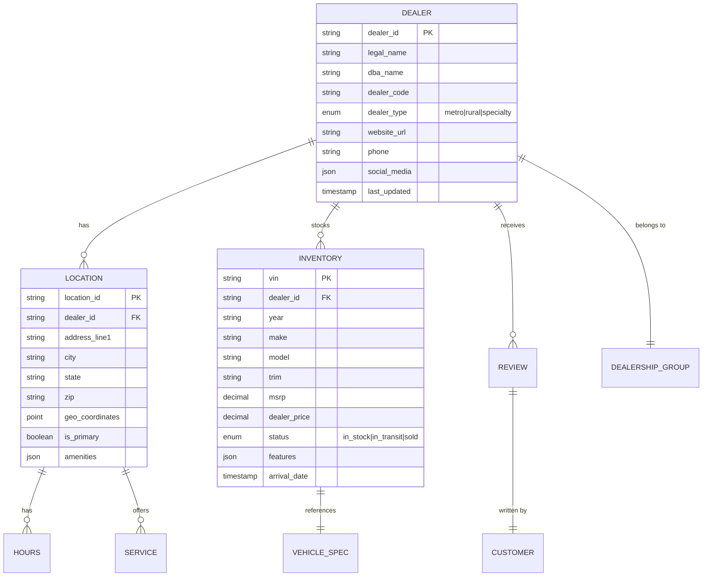

# Squad A: Data Architects
## Project 3200 - FordDirect AI Search Workshop

**Mission**: Design the "Dealer Entity Registry" - the data foundation that makes 3,200 Ford/Lincoln dealers discoverable by AI search engines. You're building the architecture, not just documentation.

---

## 🎯 Your Objective

**Design and implement the data model that answers**:
> "If FordDirect wants to make every dealer visible to ChatGPT, what data must exist? How is it structured? How is it accessed?"

**Why This Matters**:
- 3,200 dealers can't individually optimize for AI
- FordDirect sits on the "data water main" (inventory feeds, dealer data)
- Centralized optimization is the only scalable solution
- Your architecture becomes the blueprint for implementation

---

## 👥 Team Composition

**Squad Size**: 2-3 people

**Required Skills**:
- Entity-relationship modeling
- API design (REST/GraphQL)
- Database schema design
- Systems thinking

**Nice to Have** (not required):
- PostgreSQL experience
- OpenAPI/Swagger
- Automotive domain knowledge

**NOT Required**:
- LLM expertise
- Frontend development
- Deep coding (light Python/SQL is bonus)

---

## 📦 What You'll Build

### **Deliverable #1: Entity Relationship Diagram**
**File**: `dealer-entity.mermaid`

**Purpose**: Visual model of all entities and their relationships

**Core Entities**:



**Your Task**: Expand this to include:
- Financing options
- Service capabilities (EV charging, commercial fleet)
- Certifications (Ford-certified, Lincoln Black Label)
- Dealer specializations (fleet sales, commercial trucks)

---

### **Deliverable #2: Database Schema**
**File**: `database-schema.sql`

**Purpose**: Production-ready PostgreSQL schema

**Requirements**:
- Optimized for reads (AI queries will read frequently)
- Support for full-text search (dealer names, locations)
- Geospatial queries (dealers within 50 miles of ZIP)
- Audit trail (track changes for compliance)

**Example**:
```sql
CREATE TABLE dealers (
    dealer_id UUID PRIMARY KEY DEFAULT gen_random_uuid(),
    legal_name VARCHAR(255) NOT NULL,
    dba_name VARCHAR(255),
    dealer_code VARCHAR(20) UNIQUE NOT NULL,
    dealer_type VARCHAR(20) CHECK (dealer_type IN ('metro', 'rural', 'specialty', 'dealership_group', 'ev_focused')),
    website_url TEXT,
    phone VARCHAR(20),
    social_media JSONB,
    created_at TIMESTAMP DEFAULT NOW(),
    updated_at TIMESTAMP DEFAULT NOW(),

    -- Full-text search
    search_vector tsvector GENERATED ALWAYS AS (
        to_tsvector('english', coalesce(legal_name, '') || ' ' || coalesce(dba_name, ''))
    ) STORED
);

CREATE INDEX idx_dealers_search ON dealers USING GIN(search_vector);
CREATE INDEX idx_dealers_type ON dealers(dealer_type);

-- Geospatial support
CREATE EXTENSION IF NOT EXISTS postgis;

CREATE TABLE locations (
    location_id UUID PRIMARY KEY DEFAULT gen_random_uuid(),
    dealer_id UUID REFERENCES dealers(dealer_id) ON DELETE CASCADE,
    address_line1 VARCHAR(255) NOT NULL,
    city VARCHAR(100) NOT NULL,
    state CHAR(2) NOT NULL,
    zip VARCHAR(10) NOT NULL,
    geo_point GEOGRAPHY(POINT, 4326),  -- PostGIS
    is_primary BOOLEAN DEFAULT false,
    amenities JSONB,
    created_at TIMESTAMP DEFAULT NOW()
);

CREATE INDEX idx_locations_geo ON locations USING GIST(geo_point);
CREATE INDEX idx_locations_dealer ON locations(dealer_id);
```

---

### **Deliverable #3: OpenAPI Specification**
**File**: `api-spec.yaml`

**Purpose**: REST API contract for accessing dealer data

**Key Endpoints**:

```yaml
openapi: 3.0.0
info:
  title: FordDirect Dealer API
  version: 1.0.0
  description: Centralized API for AI-ready dealer data

paths:
  /api/dealers:
    get:
      summary: List dealers
      parameters:
        - name: zip
          in: query
          schema:
            type: string
        - name: radius_miles
          in: query
          schema:
            type: integer
            default: 50
        - name: dealer_type
          in: query
          schema:
            type: string
            enum: [metro, rural, specialty, dealership_group, ev_focused]
      responses:
        '200':
          description: List of dealers
          content:
            application/json:
              schema:
                type: array
                items:
                  $ref: '#/components/schemas/Dealer'

  /api/dealers/{dealer_id}:
    get:
      summary: Get dealer details
      responses:
        '200':
          description: Dealer details
          content:
            application/json:
              schema:
                $ref: '#/components/schemas/DealerDetail'

  /api/dealers/{dealer_id}/schema:
    get:
      summary: Generate Schema.org JSON-LD for dealer
      responses:
        '200':
          description: JSON-LD markup
          content:
            application/ld+json:
              schema:
                type: object

  /api/dealers/{dealer_id}/inventory:
    get:
      summary: Get dealer inventory
      parameters:
        - name: make
          in: query
          schema:
            type: string
        - name: model
          in: query
          schema:
            type: string
        - name: in_stock_only
          in: query
          schema:
            type: boolean
            default: true
      responses:
        '200':
          description: Vehicle inventory
          content:
            application/json:
              schema:
                type: array
                items:
                  $ref: '#/components/schemas/Vehicle'

  /api/dealers/{dealer_id}/readiness:
    get:
      summary: Get AI readiness score
      description: Calculates how "AI-ready" this dealer's data is
      responses:
        '200':
          description: Readiness score
          content:
            application/json:
              schema:
                $ref: '#/components/schemas/ReadinessScore'

components:
  schemas:
    Dealer:
      type: object
      properties:
        dealer_id:
          type: string
          format: uuid
        legal_name:
          type: string
        dba_name:
          type: string
        dealer_type:
          type: string
          enum: [metro, rural, specialty, dealership_group, ev_focused]
        primary_location:
          $ref: '#/components/schemas/Location'

    ReadinessScore:
      type: object
      properties:
        overall_score:
          type: integer
          minimum: 0
          maximum: 100
        factors:
          type: object
          properties:
            schema_completeness:
              type: integer
            inventory_freshness:
              type: integer
            review_recency:
              type: integer
            unique_content_ratio:
              type: integer
        recommendations:
          type: array
          items:
            type: string
```

---

### **Deliverable #4: FastAPI Implementation**
**Files**:
- `app/api/dealers.py`
- `app/models/dealer.py`
- `app/services/readiness_scorer.py`

**Purpose**: Working API that other squads can use

**Example**:
```python
# app/models/dealer.py
from pydantic import BaseModel, UUID4, HttpUrl
from typing import Optional, List
from enum import Enum

class DealerType(str, Enum):
    METRO = "metro"
    RURAL = "rural"
    SPECIALTY = "specialty"
    DEALERSHIP_GROUP = "dealership_group"
    EV_FOCUSED = "ev_focused"

class Location(BaseModel):
    location_id: UUID4
    address_line1: str
    city: str
    state: str
    zip: str
    latitude: Optional[float]
    longitude: Optional[float]
    is_primary: bool

class Dealer(BaseModel):
    dealer_id: UUID4
    legal_name: str
    dba_name: Optional[str]
    dealer_code: str
    dealer_type: DealerType
    website_url: Optional[HttpUrl]
    phone: Optional[str]
    primary_location: Location

class ReadinessScore(BaseModel):
    overall_score: int  # 0-100
    factors: dict[str, int]
    recommendations: List[str]
```

```python
# app/api/dealers.py
from fastapi import APIRouter, HTTPException, Query
from typing import List, Optional
from app.models.dealer import Dealer, ReadinessScore
from app.services.dealer_service import DealerService
from app.services.readiness_scorer import ReadinessScorer

router = APIRouter(prefix="/api/dealers", tags=["dealers"])

@router.get("/", response_model=List[Dealer])
async def list_dealers(
    zip: Optional[str] = Query(None),
    radius_miles: int = Query(50, ge=1, le=200),
    dealer_type: Optional[str] = Query(None)
):
    """List dealers, optionally filtered by location and type"""
    service = DealerService()
    return await service.find_dealers(zip=zip, radius=radius_miles, dealer_type=dealer_type)

@router.get("/{dealer_id}/readiness", response_model=ReadinessScore)
async def get_readiness_score(dealer_id: str):
    """Calculate AI readiness score for dealer"""
    scorer = ReadinessScorer()
    score = await scorer.calculate_score(dealer_id)

    if not score:
        raise HTTPException(status_code=404, detail="Dealer not found")

    return score
```

---

## 🗓️ 5-Day Timeline

### **Day 1: Discovery**
**Morning** (9am-12pm):
- Participate in "Zero-Click Challenge" (Exercise 0)
- Analyze what data LLMs need but don't have

**Afternoon** (1pm-5pm):
- Brainstorm entity model
- Research Schema.org types (LocalBusiness, AutomotiveBusiness, Vehicle)
- Define attributes (required vs. optional)

**Deliverable**: Whiteboard sketch of entities

---

### **Day 2: Entity Modeling**
**Morning** (9am-12pm):
- Exercise 1: Entity Modeling
- Create Mermaid ER diagram
- Define all entities and relationships
- Peer review with instructor

**Afternoon** (1pm-5pm):
- Write database schema (SQL)
- Consider indexes for performance
- Add constraints and validation rules

**Deliverable**: `dealer-entity.mermaid` + `database-schema.sql`

---

### **Day 3: API Design**
**Morning** (9am-12pm):
- Draft OpenAPI spec
- Define all endpoints
- Design request/response schemas
- Consider pagination, filtering, sorting

**Afternoon** (1pm-5pm):
- Implement Pydantic models
- Implement first API endpoints:
  - `GET /api/dealers`
  - `GET /api/dealers/{id}`
- Test with sample data

**Deliverable**: OpenAPI spec + basic FastAPI implementation

---

### **Day 4: Advanced Features**
**Morning** (9am-12pm):
- Implement AI Readiness Score endpoint
- Algorithm: Calculate score based on:
  - Schema completeness (40%)
  - Inventory freshness (30%)
  - Review recency (20%)
  - Unique content (10%)

**Afternoon** (1pm-5pm):
- Integrate with Squad C's Schema.org generator
- Implement `GET /api/dealers/{id}/schema` endpoint
- Test full workflow:
  1. Create dealer via API
  2. Generate JSON-LD
  3. Calculate readiness score

**Deliverable**: Working readiness scorer + schema generation

---

### **Day 5: Documentation & RFP**
**Morning** (9am-11am):
- Document API (README, examples)
- Create Postman collection
- Prepare demo

**Late Morning** (11am-12pm):
- Present architecture to "FordDirect CIO"
- Explain design decisions
- Demo API calls

**Afternoon** (1pm-3pm):
- Write RFP section: "Proposed Architecture"
- Create architecture diagrams
- Document data governance model

---

## 🛠️ Technical Setup

### **Backend Setup**
```bash
cd workshops/02-forddirect-automotive/backend
python -m venv venv
source venv/bin/activate
pip install fastapi uvicorn sqlalchemy psycopg2-binary pydantic
```

### **Database Setup**
```bash
docker-compose up -d  # Starts PostgreSQL
python scripts/seed_dealers.py  # Load sample data
```

### **Run API**
```bash
uvicorn app.main:app --reload
# API: http://localhost:8000
# Docs: http://localhost:8000/docs
```

---

## 📊 Success Criteria

### **Minimum Viable** (Must Have)
- ✅ ER diagram with 5+ entities
- ✅ Database schema (PostgreSQL)
- ✅ OpenAPI spec (5+ endpoints)
- ✅ Basic CRUD API (create, read dealers)

### **Target** (Should Have)
- ✅ Geospatial queries (find dealers within X miles)
- ✅ AI Readiness Score endpoint
- ✅ Schema.org JSON-LD generation
- ✅ Full-text search on dealer names

### **Stretch** (Nice to Have)
- ✅ GraphQL API (alternative to REST)
- ✅ Real-time inventory sync (webhooks)
- ✅ Multi-tenancy (support dealer groups)

---

## 🚧 Common Challenges & Solutions

### **Challenge 1: "How much data is too much?"**
**Solution**: Focus on "AI-relevant" attributes. Ask: "Would an LLM need this to answer a customer question?" If yes, include it.

**Example**:
- ✅ Include: Dealer hours, services offered, EV charging
- ❌ Exclude: Internal sales rep IDs, accounting codes

### **Challenge 2: "Should we normalize or denormalize?"**
**Solution**: Normalize for writes, denormalize for reads. Use materialized views for complex queries that LLMs need.

### **Challenge 3: "How do we handle 3,200 dealers?"**
**Solution**: Design for scale from day 1:
- Partition by region/state
- Index heavily (reads >> writes)
- Consider caching (Redis) for hot dealers

---

## 🤝 Collaboration Points

### **With Squad B (Measurement Engineers)**
**They need from you**:
- Dealer ground truth data (names, addresses, inventory)
- API endpoint to check if dealer exists

**You need from them**:
- Readiness score algorithm (what factors matter?)

**Integration Point**: Day 4 - Your `/readiness` endpoint uses their scoring logic

### **With Squad C (Schema Specialists)**
**They need from you**:
- Dealer data model (what attributes exist?)
- API to fetch dealer details

**You need from them**:
- JSON-LD templates (to generate schemas dynamically)

**Integration Point**: Day 4 - Your `/schema` endpoint uses their templates

---

## 📖 Resources

### **Data Modeling**
- [Mermaid ER Diagrams](https://mermaid.js.org/syntax/entityRelationshipDiagram.html)
- [PostgreSQL Best Practices](https://www.postgresql.org/docs/current/ddl.html)
- [Schema.org: LocalBusiness](https://schema.org/LocalBusiness)
- [Schema.org: AutomotiveBusiness](https://schema.org/AutomotiveBusiness)

### **API Design**
- [OpenAPI Specification](https://swagger.io/specification/)
- [FastAPI Documentation](https://fastapi.tiangolo.com/)
- [Pydantic Models](https://docs.pydantic.dev/)

### **Tools**
- [Swagger Editor](https://editor.swagger.io/) - Test OpenAPI specs
- [Mermaid Live Editor](https://mermaid.live/) - Create diagrams
- [DB Diagram](https://dbdiagram.io/) - Visual schema design

---

## 🎯 RFP Contribution

**Your Section**: "Proposed Architecture"

**What You'll Write** (in RFP):

1. **System Overview**
   - High-level architecture diagram
   - Data flow (dealer systems → FordDirect → LLMs)
   - Why centralized beats distributed optimization

2. **Data Model**
   - ER diagram (simplified for executives)
   - Core entities explained
   - How this scales to 3,200 dealers

3. **API Design**
   - REST endpoints
   - Key use cases (find nearby dealers, get inventory)
   - Security model (API keys, rate limiting)

4. **AI Readiness Framework**
   - What makes a dealer "AI-ready"?
   - Scoring algorithm
   - How FordDirect can track improvement

5. **Implementation Plan**
   - Phase 1: Core API (3 months)
   - Phase 2: Schema generation (6 months)
   - Phase 3: Real-time sync (9 months)

---

## 💡 Key Insight for Your Squad

**FordDirect doesn't need 3,200 websites optimized. They need ONE API that feeds all 3,200 dealers to AI search engines.**

Your architecture makes this possible by:
- Centralizing dealer data (single source of truth)
- Exposing it via clean API (easy for AI to consume)
- Calculating readiness scores (measure progress)

This is fundamentally different from traditional SEO (which is site-by-site).

**Your competitive advantage**: Understanding that scale requires centralization.

---

## 🚀 Getting Started (Day 1 AM)

1. Read this brief fully
2. Participate in Exercise 0 (Zero-Click Challenge)
3. Meet with your squad (1 hour)
4. Assign roles:
   - **Lead**: Overall design, RFP writing
   - **Data Modeler**: ER diagram, database schema
   - **API Designer**: OpenAPI spec, FastAPI implementation
5. Set up development environment
6. Create first Mermaid diagram (whiteboard → digital)

**First Task**: List 10 attributes a dealer MUST have to be visible to AI. Prioritize by importance.

---

**Good luck, Data Architects! You're building the foundation everything else rests on. 🏗️**
